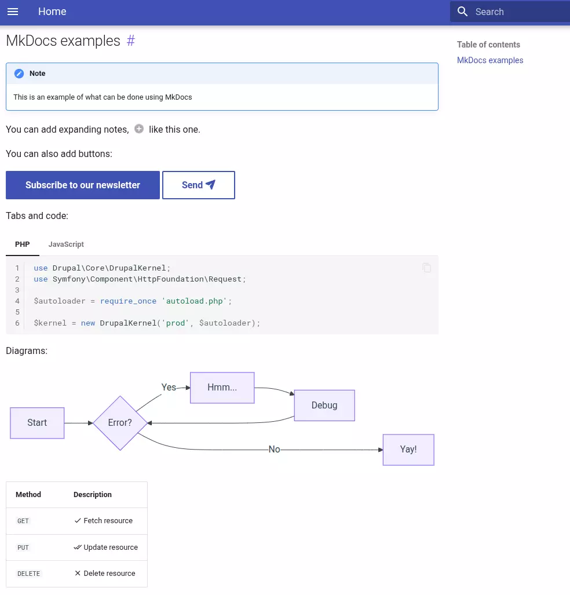

[](https://github.com/Metadrop/ddev-mkdocs/actions/workflows/tests.yml) 


* [What is DDEV Mkdocs Add-on?](#what-is-ddev-mkdocs-add-on)
* [Getting started](#getting-started)
* [Using mkdocs](#using-mkdocs)
  * [Configuration](#configuration)
  * [Write your own documentation](#write-your-own-documentation)
  * [View the documentation](#view-the-documentation)

## What is DDEV MkDocs Add-on?

This repository provides a [DDEV](https://ddev.readthedocs.io) add-on for the [mkdocs](https://www.mkdocs.org/) service, based on [Metadrop MkDocs Docker image](https://github.com/Metadrop/docker-mkdocs).

It includes [MkDocs Material theme](https://squidfunk.github.io/mkdocs-material/) pre-installed.

MkDocs is a fast, simple and downright gorgeous static site generator that's geared towards building project documentation. Documentation source files are written in Markdown, and configured with a single YAML configuration file.

This addon just provides the basics to view MkDocs static site from docs/ folder on your project.

## Getting started

Install this addon with

```shell
ddev get Metadrop/ddev-mkdocs
```

After that you need to restart the ddev project:

```shell
ddev restart
```

## Using MkDocs

### What can be done?

MkDocs provides:

  - Syntax highlighting
  - Search functionality
  - Navigation
  - Elements like tabs, buttons, grids, messages boxes or admonitions, etc
  - Mermaid diagrams
  - And more!


Example:




### Configuration

By default, MkDocs addon show docs from `/docs` folder inside your project. This can be updated in docker-compose.mkdocs.yaml as needed.

Also this addon uses ports 9004 and 9005 to view documentation, this can be updated in docker-compose.mkdocs.yaml too.

### Write your own documentation

To start building your docs you can read the [Mkdocs getting started guide](https://www.mkdocs.org/getting-started/) and for more advanced functionalities here is the [Mkdocs user guide](https://www.mkdocs.org/user-guide/).

Also, check [Material for MkDocs reference documentation].


### View the documentation

MkDocs documentation can be accessed in https://${PROJECT_NAME}.ddev.site:9005
